# 🧠 TwinSqueeze: Contrastive Compression with NEFTune Regularization

**TwinSqueeze** is a Siamese network designed to compress high-dimensional sentence embeddings (e.g., 384-dim from MiniLM) into a smaller, task-optimized vector (e.g., 32-dim) while preserving cosine similarity. This project also systematically studies **NEFTune**, a simple noise-based regularization strategy, by analyzing its effect on generalization and ranking quality.

---

## 🎯 Goals

1. **Compress Embedding Vectors**  
   Reduce dimensionality (e.g. 384 → 32) to improve:
   - **Latency in RAG pipelines**
   - **Memory usage in embedding storage**
   - **Speed of ANN vector search** for tools like FAISS, qdrant, or custom indexers

2. **Task-Aligned Similarity**  
   Along with preserving raw sentence similarity, TwinSqueeze is trained to:
   - Compress embeddings to **reflect domain/task-specific cosine similarity**
   - Optimize for **ranking alignment** (Spearman) — crucial for information retrieval
   - Modify similarity depending on your use case, improving results for custom RAG needs

3. **Plug-and-Play for Custom RAG Systems**  
   TwinSqueeze can be integrated into:
   - 🔹 **Voyager-like local memory agents** to compress thought/action logs
   - 🔹 **Local blog/document retrievers** to reduce storage and maintain performance
   - 🔹 Any **custom RAG pipeline** to:
     - Decrease search/query cost
     - Improve ranking robustness (via NEFTune)
     - Handle noisy input or noisy memory gracefully

> 📌 If you're building your own agent memory or domain-specific retriever, TwinSqueeze helps scale similarity logic without depending on external APIs.

---

## 🚀 What This Project Does

- ✅ Compresses sentence embeddings using a 3-layer MLP
- ✅ Trains on STS-B sentence similarity scores using cosine + MSE
- ✅ Applies **NEFTune** by injecting noise into input embeddings
- ✅ Evaluates models using:
  - MSE / MAE (point error)
  - Pearson / Spearman (ranking)
- ✅ Visualizes:
  - Training loss curves
  - Per-sample prediction accuracy
  - Loss distributions (paper-style)

---

## 📦 Project Structure

```
twin_squeeze_pipeline/
│
├── model.py              # Siamese compression + cosine similarity
├── trainer.py            # Training loop with loss logging
├── logger.py             # Result saving, chart export, CSV writing
├── dataloader.py         # Dataset loading + NEFTune noise injection
├── test.py               # Evaluation metrics + prediction plots
├── neftune_utils.py      # (Optional) NEFTTune loss analysis tools
│
├── models/               # Trained .pt model weights
├── results/
│   ├── benchmark_charts/ # All visualizations and comparisons
│   └── metrics_stsb.csv  # Final metric scores across runs
```

---

## 🧪 Experimental Setup

### Dataset
- **STS-B** from GLUE benchmark
- Scores normalized to [0, 1] and scaled using tanh-like function

### Embeddings
- Sentence embeddings from `all-MiniLM-L6-v2` (384-dim)
- Noise added **before compression** as per NEFTune formula:
```
embedding_noised = embedding + Uniform(-1,1) * (alpha / sqrt(dim))
```

### Model Architecture
- Twin input → shared MLP compression block:
```
Linear(384 → 128) → ReLU →
Linear(128 → 64) → ReLU →
Linear(64 → compressed_dim)
```
- Cosine similarity computed after normalization
- Trained with MSE loss

---

## 🧩 NEFTune Ablation

We tested the effect of NEFTune on compressed representations using various `alpha` values:

| Model               | α    | MSE     | MAE     | Pearson | Spearman |
|--------------------|------|---------|---------|---------|----------|
| **Baseline**        | 0.0  | 0.0720  | 0.2034  | 0.7310  | 0.7750   |
| twin_cd32_alpha0.5  | 0.5  | 0.0683  | 0.1983  | 0.7740  | **0.8145** |
| twin_cd32_alpha0.75 | 0.75 | 0.0720  | 0.2009  | 0.7738  | **0.8185** |
| twin_cd32_alpha1.0  | 1.0  | 0.0823  | 0.2151  | 0.7481  | 0.7984   |
| twin_cd32_alpha3.0  | 3.0  | 0.1538  | 0.2987  | 0.6475  | 0.7622   |

### 🏆 Key Insights

- `α = 0.5–0.75` improves **Spearman correlation**
- `α = 3.0` hurts both generalization and prediction alignment
- NEFTune introduces higher training loss (as expected), but better test generalization

---

## 📊 Visualizations

### ✅ Training Loss Comparison (all alphas)
Shows how training loss evolves across epochs for each NEFTune `α` value. Baseline converges faster, but lower noise (α = 0.5, 0.75) still tracks well while improving generalization.

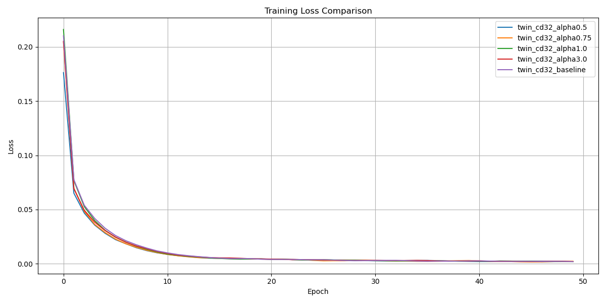

---

### ✅ Per-Model Cosine Prediction vs Ground Truth
Visualizes how predicted cosine similarity aligns with ground truth for the first 50 validation samples. Smoother alignment reflects better ranking behavior.

- **α = 0.5**
  
  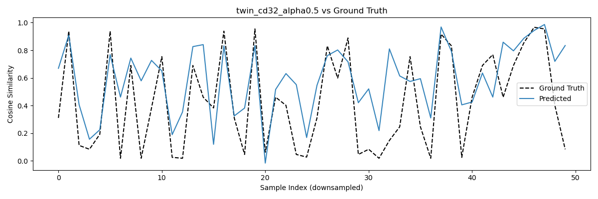

- **α = 0.75**
  
  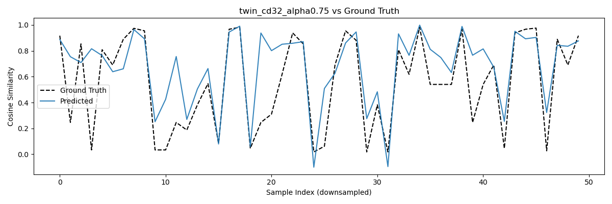

- **α = 1.0**
  
  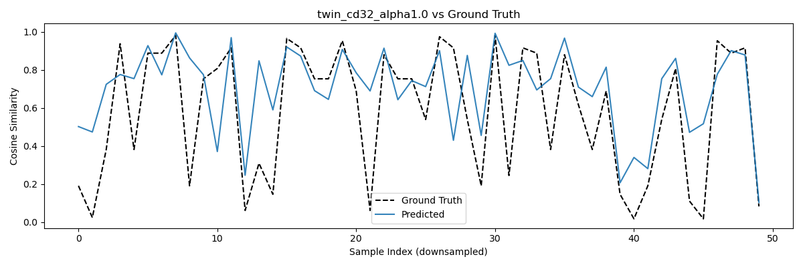

- **α = 3.0**
  
  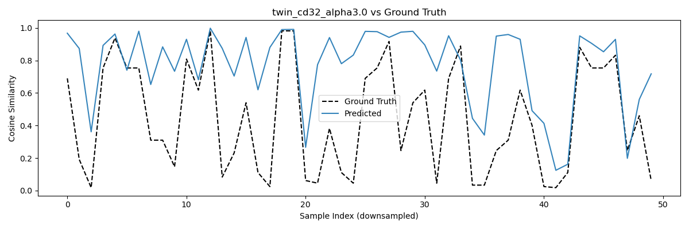

- **Baseline**
  
  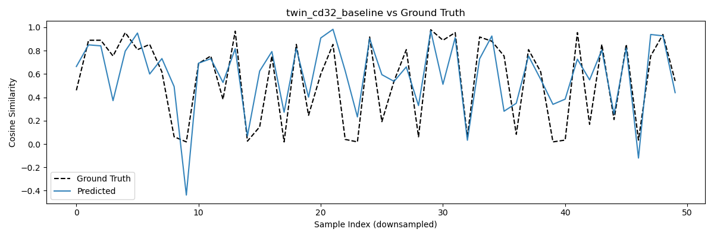

---

### ✅ Paper-Style Loss Distributions (Train vs Test)

These histograms replicate the visualization style used in the original NEFTune paper. Each pair compares **Baseline** vs NEFTuned model for a specific `α`:

- **α = 0.5**

  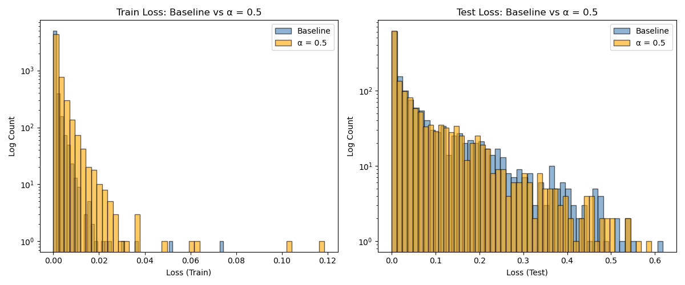

- **α = 0.75**

  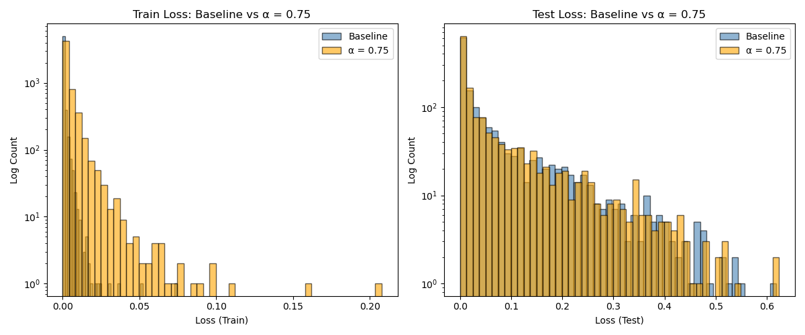

- **α = 1.0**

  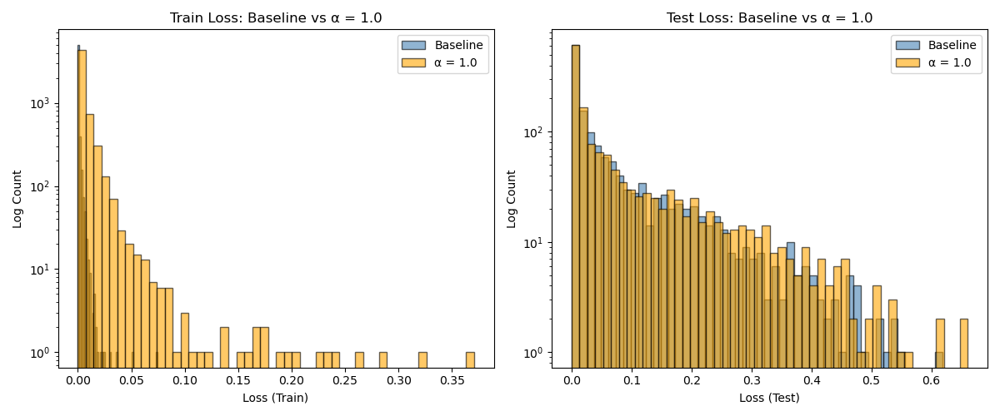

- **α = 3.0**

  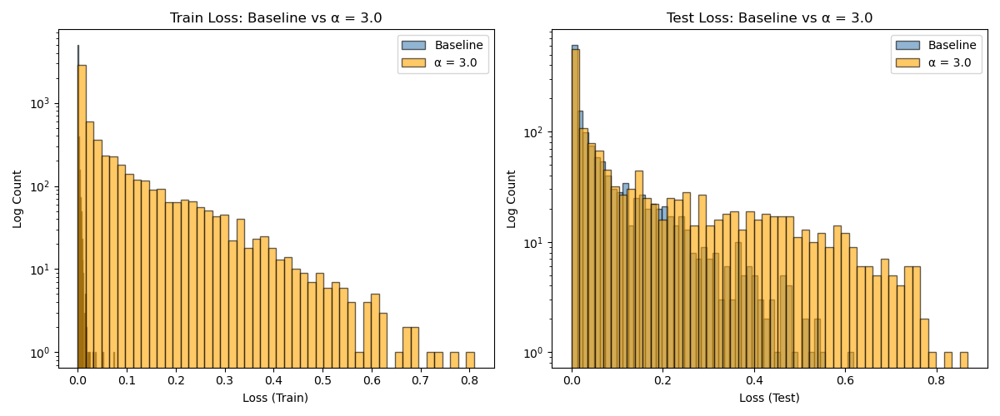

---

### ✅ All Models vs Ground Truth (Comparison Chart)

One chart showing all model predictions overlaid against ground truth, downsampled for clarity.

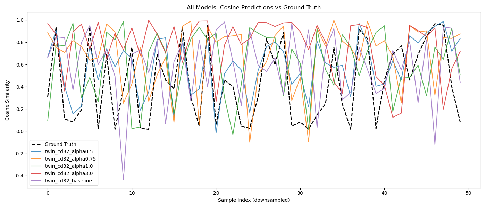

> 📌 Log-scale histograms show higher training loss for NEFT, but tighter generalization on test set — exactly as shown in the NEFTune paper.

---

## 🧠 What You Can Learn From This

- How to implement a Siamese embedding compression model
- How to apply NEFTune noise injection for robustness
- How to interpret ranking-based vs value-based metrics
- How to reproduce paper-style visual ablations and histograms
- How to integrate compressed embeddings into **custom RAG pipelines**

---

## 🛠️ Run It Yourself

```
# Install requirements
pip install torch datasets sentence-transformers matplotlib

# Run training + loss logging
python train_experiment.py  # or your notebook pipeline

# Generate evaluation reports
python test_all_models.py

# Compare NEFTune variants
python neftune_loss_overlay.py
```

---

## 📎 Credits

- Inspired by [NEFTune: Noisy Embeddings Improve Fine-tuning](https://arxiv.org/abs/2305.14995)
- Embedding backbone: `sentence-transformers/all-MiniLM-L6-v2` (Apache 2.0)
- Developed by Medhavi Monish
